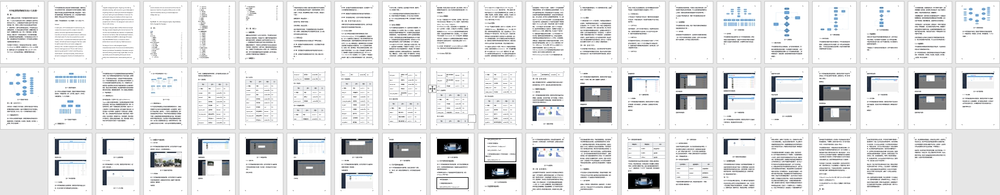
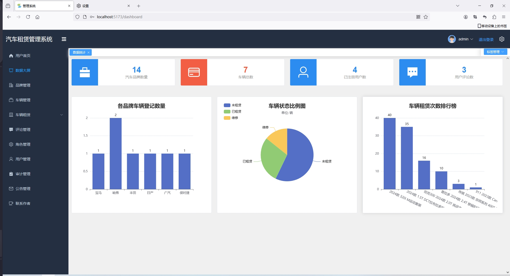
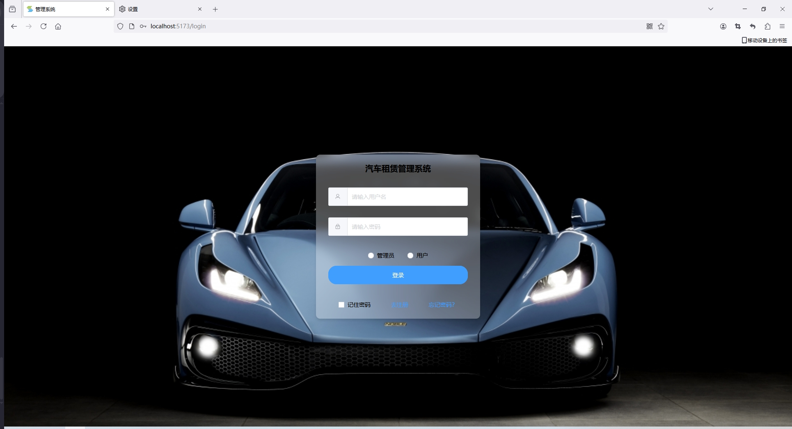
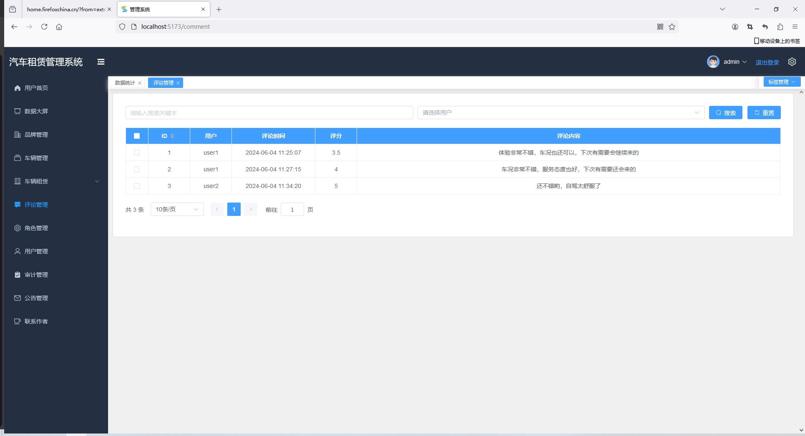
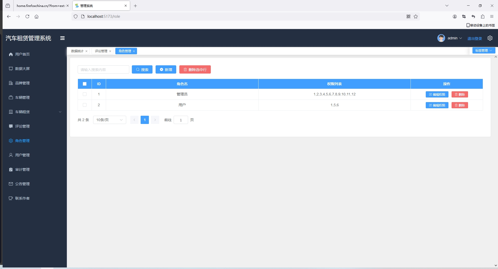
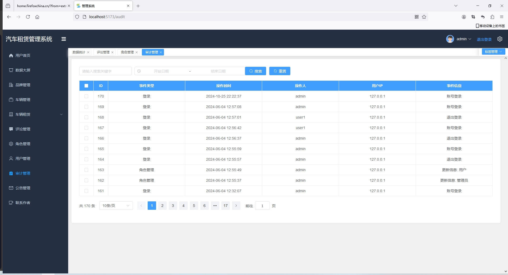
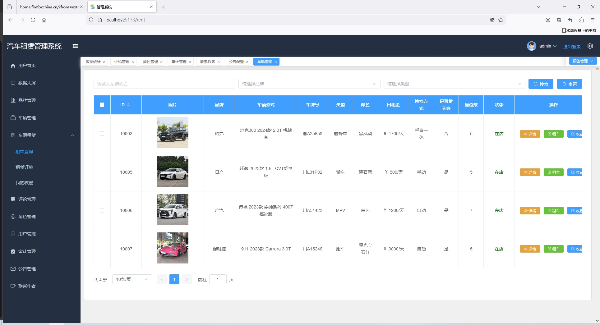

<h1 align="center">Python+Vue3前后端分离汽车租赁管理系统【带文档】</h1>

<h4> 完整代码获取地址：从戎源码网（https://armycodes.com/） </h4>
<h4> 作者微信：19941326836 QQ：605739993 QQ群：655392706 </h4>
<h4> 承接计算机毕设、Java毕业设计、Python毕业设计、深度学习、机器学习 </h4>
<h4> 选题+开题报告+任务书+程序定制+安装调试+论文+答辩ppt 一条龙服务 </h4>
<h4> 毕业设计所有选题地址：(https://github.com/Descartes007/allProject) </h4>

## 项目介绍

Python+Vue3前后端分离汽车租赁管理系统【带文档】：前端 Vue3 pinia ElementPlus Echarts Axios，后端 Python3 Flask，系统角色分为：管理员和读者，管理员在管理后台对用户信息、车辆信息管理等；用户可以车辆租赁等。主要功能如下：

## 功能

-   [x] 首页大屏、汽车展览推荐和数据可视化展示
-   [x] 汽车品牌管理： 增删改查
-   [x] 车辆管理： 录入、查询、删除、修改、图片上传
        车辆查询、租车、归还车辆，评论和打分
-   [x] 角色+权限管理： 增删改查，可自定义用户角色名称和权限
-   [x] 评论管理： 查询用户评论
-   [x] 用户管理： 增删改查
-   [x] 公告管理： 公告配置用于推送给用户，公告列表
-   [x] 运行日志和安全审计日志
-   [x] 用户中心
-   [x] 全局颜色方案修改

## 环境

- <b>IntelliJ IDEA 2020.3</b>

- <b>Mysql 5.7.26</b>

- <b>Python 3.8</b>

- <b>Nodejs 14.17.3</b>

- <b>Redis 3.200.0</b>

- <b>Flask</b>

## 运行截图

### 论文截图

### 程序截图

## 访问页面
http://127.0.0.1:5173

管理员账号：admin/12345678
用户账号: user1/12345678

